	 
	
	 

<!----------------------------------------------------------------------------------------->

<h1>La Piscine Web@cadémie 2020-2021.</h1>

Voilà en public mes rendus pour la piscine de la Web @académie.

<!----------------------------------------------------------------------------------------->

<h1>Disclaimer !</h1>

Je précise pour vous, les petits malins, qui actuellement sont en période de piscine et qui se sont égaré sur mon repo.

Copier c'est mal ! Ne reprenez pas le travail des autres !😖

Soyez de bon petit soldat et armez-vous de vos lunettes et go lire la documentation PHP et suivre les tutoriels du site du zéro.😋

Et entre nous prendre ce que j'ai faits, bah c'est con. Beaucoup d'erreurs faites lors de la piscine sont surement encore glissées dans mes exercices. Et j'avoue, j'ai la flemme de les corriger... 🤣 
  

Vous pouvez regarder la logique que j'ai adoptée pour résoudre les sujets, bien qu'elle soit bancale.... 😅 Sinon, je vous souhaite bonne chance et avant que j'oublie ! 
  

<h3>Bienvenue à Epitech !</h3>

<!----------------------------------------------------------------------------------------->